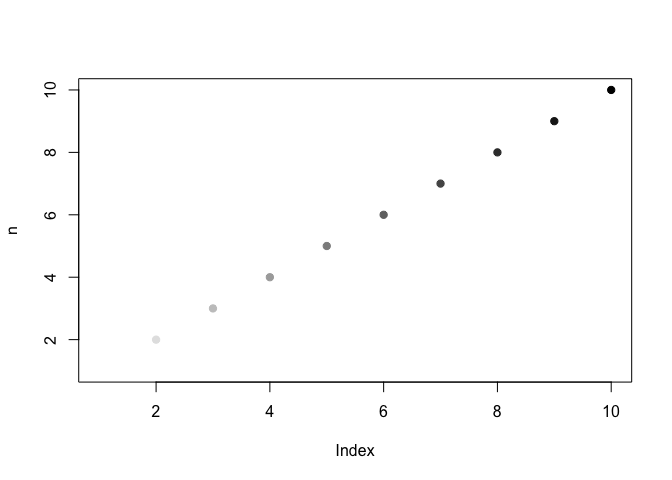
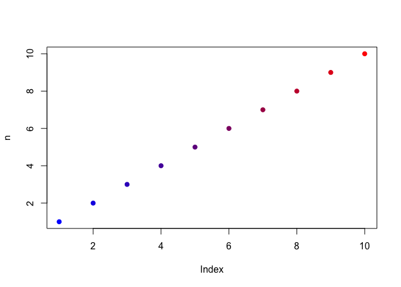
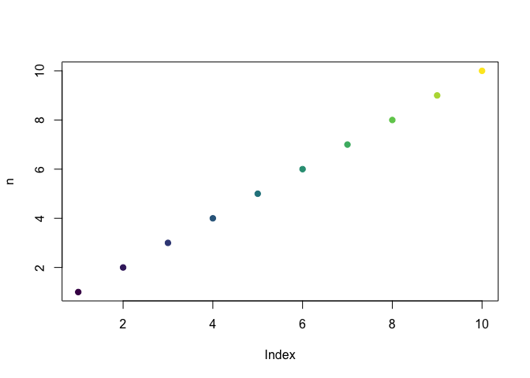
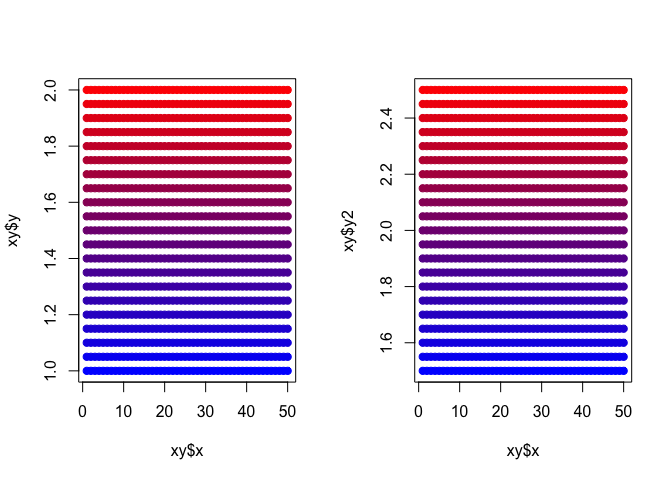
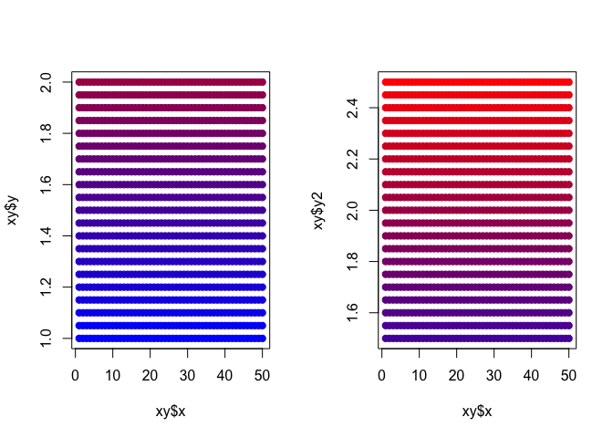

scale\_color\_base

Map a custom color palette to a vector of values in base R
==========================================================

### Description

This function uses base R functions to conveniently map a custom color palette to a vector of values. The function returns a character vector (the same length as the input vector of values) with hex strings representing a color. This vector is suitable for passing to the col= argument in a plot() function call.

Motivation: I've always had a hard time wrapping my head around the color ramps in base R when plotting. I wanted a simple way to pass a vector of colors to the `plot()` function that mapped those colors to the values being plotted. This is the solution I came up with.

### Usage

``` r
## Map vector of values to a white to black ramp spanning
## range of those values
scale_color_base(value)

## Map vector of values to a user-specified series of colors
scale_color_base(value, colors = c("blue", "red"))
scale_color_base(value, colors = viridis::viridis(10))

## Map vector of values to a user-specified series of colors
## and a user-specified range of values
scale_color_base(value, mapToRange = c(-1, 1))

## Adjust the transparency of the colors (uses adjustcolor() function)
scale_color_base(value, colors = c("blue", "red"), alpha = 0.5)

## Print the recast values of the original value= argument. These 
## are the actual values used in mapping to the color palette so
## can be used to assess how a vector of values will relate to
## each other on the palette
scale_color_base(value, mapToRange = c(-1, 1), printRecast = TRUE)
```

### Arguments

`value=` is a vector of numeric values

`colors=` is a vector of colors that gets passed to colorRamp for interpolation. Can be a character vector of color names, a character vector of hex values, or numeric vector of positive integers. Lower values map to the first elements of the vector, higher values map to the last elements of the vector. Default is palette is white to black.

`na.rm=` gets passed to the range function via the mapToRange argument. Using na.rm=TRUE is required if you want the function to ignore NAs and map to non-NA values. Default is FALSE.

`mapToRange=` is a 2-element numeric vector representing the minimum and maximum (in that order) fixed numeric range to map the values to. Passing the result of any call to `range()` would be sufficient. Example: `range(c(vector1, vector2))` gets the overall range for both vectors. The default is the vector returned by calling the `range()` function on the supplied value= argument.

`alpha=` is a transparency option. Useful when lots of points are being plotted. Default is 1 (totally opaque).

`printRecast=` is a logical that specifies whether the recast values are to be printed to the console. This might be useful when determining how a particular numeric vector might be mapped to a new range (when also using mapToRange= argument)

### Value Returned

A character value of hex color values with a length equal to the length of value where each color value represents the mapping of each value to a continuous color palette.

### Examples

The function returns the character vector of colors to match to each value in the `value=` vector argument.

``` r
n <- 1:10
scale_color_base(n)
```

    ##  [1] "#FFFFFFFF" "#E3E3E3FF" "#C6C6C6FF" "#AAAAAAFF" "#8E8E8EFF"
    ##  [6] "#717171FF" "#555555FF" "#393939FF" "#1C1C1CFF" "#000000FF"

At it's simplest, the `scale_color_base()` function can make a plot like this:

``` r
plot(n, pch = 19, col = scale_color_base(n))
```



We can adjust the colors that the `value=` vector will be mapped to:

``` r
plot(n, col = scale_color_base(n, colors=c("blue", "red")), pch = 19)
```



More than two colors are possible. I highly recommend viridis color palettes from the `viridis` package.

``` r
plot(n, col = scale_color_base(n, colors = c("blue", "purple", "red")), pch = 19)
```


``` r
plot(n, col = scale_color_base(n, colors = viridis::viridis(5)), pch = 19)
```



Fix the numeric range to map the values to. This is useful for comparing two vectors with the same color palette. When the colors get mapped to value vectors separately, they reflect the ranges of those separate vectors. But if we want to compare vectors, we need to use the same color palette standard. The `mapToRange=` argument helps us do that:

``` r
par(mfrow = c(1,2)) # Make the plots side-by-side
x <- 1:50
y <- seq(from = 1, to = 2, by = 0.05)
xy <- expand.grid(x, y)
names(xy) <- c("x", "y")

# As we've been doing, mapping they y column to a blue/red color palette...
plot(x = xy$x, y = xy$y, pch = 19, col = scale_color_base((xy$y), colors = c("blue", "red")))

# But the new variable y2 is 0.5 greater (50% of original range) than y. 
# Mapping to its range will show the exact same plot as when the range
# was 1 to 2 as when the range is 1.5 to 2.5, which doesn't 
# appropriately demonstrate that they y-axes are different scales:
xy$y2 <- xy$y + 0.5
plot(x = xy$x, y = xy$y2, pch = 19, col = scale_color_base((xy$y2), colors = c("blue", "red")))
```



``` r
# But if we want to compare the two ranges side by side, we want the 
# color palette to reflect that the second range is greater than the 
# first. So we can use the mapToRange= argument to fix the range that 
# we want to map the values of each vector to.

# The range we want to map to is the min and max of the WHOLE range 
# of the data, including both vectors.
new_range <- range(c(xy$y, xy$y2))
new_range
```

    ## [1] 1.0 2.5

``` r
par(mfrow=c(1,2)) # Make the plots side-by-side
plot(x = xy$x, y = xy$y, pch = 19, col = scale_color_base((xy$y), colors = c("blue", "red"), mapToRange = new_range))

plot(x = xy$x, y = xy$y2, pch = 19, col = scale_color_base((xy$y2), colors = c("blue", "red"), mapToRange = new_range))
```


